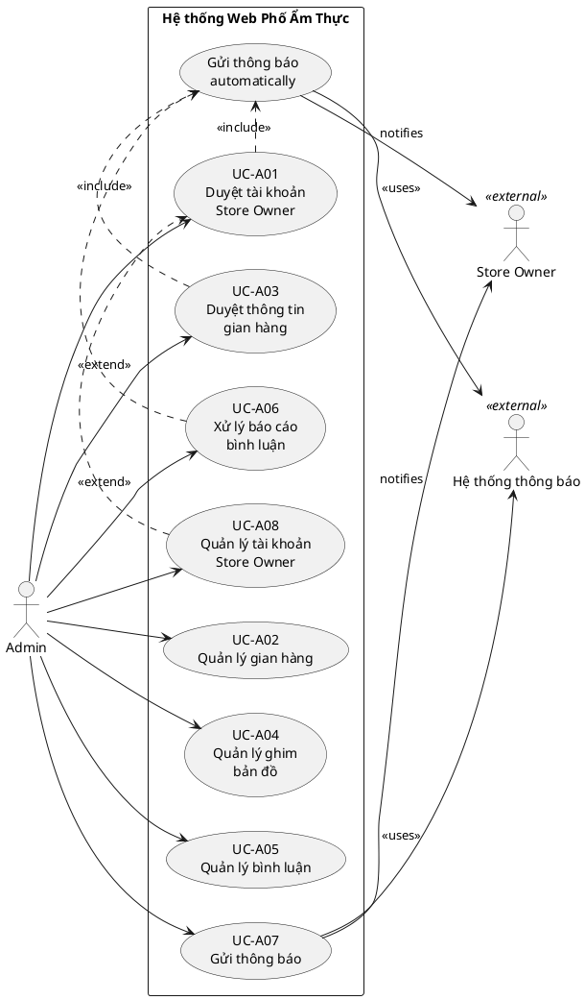

# Use Cases — Admin
> Hệ thống Web Phố Ẩm Thực | Phiên bản: 1.0 | Ngày: 2026-03-28

---

## Use Case Diagram

---

## UC-A01: Duyệt tài khoản Store Owner

| Thuộc tính | Nội dung |
|---|---|
| **ID** | UC-A01 |
| **Tên** | Duyệt tài khoản Store Owner |
| **Actor** | Admin |
| **Mô tả** | Admin xem xét và phê duyệt hoặc từ chối các tài khoản Store Owner đăng ký mới. |
| **Precondition** | Admin đã đăng nhập hệ thống. Có tài khoản Store Owner đang ở trạng thái **chờ duyệt**. |
| **Postcondition** | Tài khoản được kích hoạt (active) hoặc từ chối; Store Owner nhận thông báo qua email |

**Luồng chính:**
1. Admin truy cập mục "Quản lý tài khoản".
2. Hệ thống hiển thị danh sách tài khoản đang chờ duyệt.
3. Admin chọn một tài khoản để xem chi tiết thông tin đăng ký.
4. Admin chọn "Phê duyệt".
5. Hệ thống cập nhật trạng thái tài khoản thành **active**.
6. Hệ thống gửi thông báo (email) đến Store Owner: "Tài khoản của bạn đã được phê duyệt."

**Luồng thay thế:**
- [Bước 4] Admin chọn "Từ chối" → Admin nhập lý do từ chối → hệ thống cập nhật trạng thái tài khoản thành **từ chối** và gửi thông báo kèm lý do đến Store Owner qua email.

---

## UC-A02: Quản lý gian hàng

| Thuộc tính | Nội dung |
|---|---|
| **ID** | UC-A02 |
| **Tên** | Quản lý gian hàng |
| **Actor** | Admin |
| **Mô tả** | Admin kích hoạt, vô hiệu hóa hoặc xóa gian hàng trong hệ thống. |
| **Precondition** | Admin đã đăng nhập hệ thống. |
| **Postcondition** | Trạng thái gian hàng được cập nhật theo thao tác của Admin. |

**Luồng chính (Kích hoạt gian hàng):**
1. Admin truy cập mục "Quản lý gian hàng".
2. Hệ thống hiển thị danh sách tất cả gian hàng kèm trạng thái.
3. Admin chọn gian hàng cần kích hoạt.
4. Admin chọn "Kích hoạt".
5. Hệ thống cập nhật trạng thái gian hàng thành **active**.
6. Gian hàng hiển thị công khai cho Customer.

**Luồng thay thế:**
- [Bước 4] Admin chọn "Vô hiệu hóa" → hệ thống cập nhật trạng thái thành **inactive**; gian hàng ẩn khỏi danh sách công khai; QR code của gian hàng trả về trang lỗi.
- [Bước 4] Admin chọn "Xóa" → hệ thống yêu cầu xác nhận → Admin xác nhận → hệ thống xóa gian hàng và toàn bộ dữ liệu liên quan.

**Luồng ngoại lệ:**
- [Bước 4] Xóa gian hàng đang có bình luận hoặc đánh giá → hệ thống cảnh báo "Gian hàng này còn dữ liệu liên quan. Xác nhận xóa toàn bộ?" trước khi thực hiện.

---

## UC-A03: Duyệt thông tin gian hàng

| Thuộc tính | Nội dung |
|---|---|
| **ID** | UC-A03 |
| **Tên** | Duyệt thông tin gian hàng |
| **Actor** | Admin |
| **Mô tả** | Admin xem xét toàn bộ thay đổi thông tin gian hàng (tên, mô tả, món ăn, hình ảnh) do Store Owner gửi lên và phê duyệt hoặc từ chối kèm lý do. Khi được duyệt, thông tin mới lên live; trường mô tả đồng thời trở thành nội dung thuyết minh và AI tự động tổng hợp audio. |
| **Precondition** | Admin đã đăng nhập. Có thông tin gian hàng đang ở trạng thái **chờ duyệt**. |
| **Postcondition** | Thông tin gian hàng được phê duyệt (hiển thị công khai, AI tổng hợp audio từ mô tả) hoặc từ chối (Store Owner nhận thông báo kèm lý do). |

**Luồng chính:**

1. Admin nhận thông báo có thông tin gian hàng mới chờ duyệt.
2. Admin truy cập mục "Duyệt thông tin gian hàng".
3. Hệ thống hiển thị danh sách các gian hàng có thay đổi đang chờ duyệt.
4. Admin chọn một gian hàng để xem chi tiết thay đổi (so sánh thông tin cũ và mới).
5. Admin chọn "Phê duyệt".
6. Hệ thống cập nhật thông tin gian hàng thành **đã duyệt**; thông tin mới hiển thị công khai.
7. Hệ thống gửi thông báo (email ) đến Store Owner: "Thông tin gian hàng của bạn đã được phê duyệt."

**Luồng thay thế:**

- [Bước 5] Admin chọn "Từ chối" → Admin nhập lý do từ chối (bắt buộc) → hệ thống cập nhật trạng thái thành **bị từ chối**; thông tin cũ tiếp tục hiển thị → hệ thống gửi thông báo kèm lý do đến Store Owner.

---

## UC-A04: Quản lý ghim bản đồ

| Thuộc tính | Nội dung |
|---|---|
| **ID** | UC-A04 |
| **Tên** | Quản lý ghim bản đồ |
| **Actor** | Admin |
| **Mô tả** | Admin duyệt vị trí ghim do Store Owner gửi lên, điều chỉnh tọa độ hoặc xóa ghim của bất kỳ gian hàng nào. |
| **Precondition** | Admin đã đăng nhập. |
| **Postcondition** | Vị trí ghim được duyệt (hiển thị công khai) hoặc điều chỉnh/xóa theo thao tác của Admin. |

**Luồng chính (Duyệt ghim):**
1. Admin truy cập mục "Quản lý bản đồ".
2. Hệ thống hiển thị danh sách các vị trí ghim đang chờ duyệt trên bản đồ.
3. Admin chọn một ghim để xem chi tiết tọa độ và thông tin gian hàng.
4. Admin xác minh vị trí hợp lệ.
5. Admin chọn "Phê duyệt".
6. Hệ thống cập nhật ghim thành **đã duyệt**; vị trí hiển thị công khai trên bản đồ cho Customer.
7. Hệ thống gửi thông báo đến Store Owner: "Vị trí gian hàng của bạn đã được duyệt."

**Luồng thay thế:**
- [Bước 5] Admin chọn "Điều chỉnh tọa độ" → Admin kéo ghim hoặc nhập tọa độ mới → Admin phê duyệt với tọa độ đã điều chỉnh.
- [Bước 5] Admin chọn "Từ chối" → nhập lý do → gửi thông báo đến Store Owner.
- [Bước 2] Admin xóa ghim của gian hàng đang hoạt động → hệ thống yêu cầu xác nhận → ghim bị xóa và gian hàng không còn hiển thị trên bản đồ. thông báo về store owner

**Luồng ngoại lệ:**
- [Bước 4] Tọa độ trùng với gian hàng khác → hệ thống hiển thị cảnh báo để Admin xem xét trước khi duyệt.

---

## UC-A05: Quản lý bình luận

| Thuộc tính | Nội dung |
|---|---|
| **ID** | UC-A05 |
| **Tên** | Quản lý bình luận |
| **Actor** | Admin |
| **Mô tả** | Admin xem, ẩn hoặc xóa các bình luận của Customer vi phạm tiêu chuẩn cộng đồng. |
| **Precondition** | Admin đã đăng nhập. |
| **Postcondition** | Bình luận vi phạm được ẩn hoặc xóa khỏi hệ thống. |

**Luồng chính:**
1. Admin truy cập mục "Quản lý bình luận".
2. Hệ thống hiển thị danh sách bình luận của tất cả gian hàng.
3. Admin tìm kiếm hoặc lọc bình luận theo gian hàng, trạng thái, từ khóa.
4. Admin chọn bình luận cần xử lý.
5. Admin chọn "Ẩn bình luận".
6. Hệ thống ẩn bình luận; bình luận không còn hiển thị với Customer nhưng vẫn lưu trong hệ thống.

**Luồng thay thế:**
- [Bước 5] Admin chọn "Xóa bình luận" → hệ thống yêu cầu xác nhận → Admin xác nhận → bình luận bị xóa vĩnh viễn.
- [Bước 5] Admin chọn "Bỏ ẩn" (đối với bình luận đã bị ẩn trước đó) → bình luận hiển thị lại.

**Luồng ngoại lệ:**
- [Bước 3] Không có bình luận nào → hệ thống thông báo "Chưa có bình luận nào trong hệ thống."

---

## UC-A06: Xử lý báo cáo bình luận

| Thuộc tính | Nội dung |
|---|---|
| **ID** | UC-A06 |
| **Tên** | Xử lý báo cáo bình luận |
| **Actor** | Admin |
| **Mô tả** | Admin xem xét các báo cáo bình luận vi phạm do Store Owner gửi lên và quyết định xử lý. |
| **Precondition** | Admin đã đăng nhập. Có báo cáo bình luận đang ở trạng thái **chờ xử lý**. |
| **Postcondition** | Báo cáo được xử lý; bình luận bị ẩn/xóa hoặc giữ nguyên tùy quyết định của Admin. |

**Luồng chính:**
1. Admin nhận thông báo có báo cáo bình luận mới.
2. Admin truy cập mục "Báo cáo bình luận".
3. Hệ thống hiển thị danh sách báo cáo kèm: nội dung bình luận, lý do báo cáo, gian hàng liên quan.
4. Admin xem xét nội dung bình luận và lý do báo cáo.
5. Admin chọn "Ẩn bình luận" nếu xác nhận vi phạm.
6. Hệ thống ẩn bình luận và đánh dấu báo cáo là **đã xử lý**. và thông báo về Store Owner: "Bình luận của bạn đã bị ẩn do vi phạm tiêu chuẩn cộng đồng."

**Luồng thay thế:**
- [Bước 5] Admin chọn "Bác bỏ báo cáo" (bình luận không vi phạm) → hệ thống đánh dấu báo cáo là **bác bỏ**; bình luận tiếp tục hiển thị.
- [Bước 5] Admin chọn "Xóa bình luận" thay vì ẩn → bình luận bị xóa vĩnh viễn.

---

## UC-A07: Gửi thông báo

| Thuộc tính | Nội dung |
|---|---|
| **ID** | UC-A07 |
| **Tên** | Gửi thông báo |
| **Actor** | Admin |
| **Mô tả** | Admin soạn và gửi thông báo đến một gian hàng cụ thể hoặc toàn bộ Store Owner trong hệ thống. |
| **Precondition** | Admin đã đăng nhập. Có ít nhất một tài khoản Store Owner đang active. |
| **Postcondition** | Thông báo được gửi thành công qua email và hệ thống thông báo nội bộ. |

**Luồng chính:**
1. Admin truy cập mục "Gửi thông báo".
2. Hệ thống hiển thị form soạn thông báo.
3. Admin chọn đối tượng nhận: **một gian hàng cụ thể** hoặc **tất cả gian hàng**.
4. Admin nhập tiêu đề và nội dung thông báo.
5. Admin xem trước thông báo và chọn "Gửi".
6. Hệ thống gửi thông báo đồng thời qua hai kênh: **email** và **thông báo nội bộ**.
7. Hệ thống xác nhận "Gửi thông báo thành công" và ghi nhận lịch sử gửi.

**Luồng thay thế:**
- [Bước 3] Admin chọn nhiều gian hàng cụ thể (không phải tất cả) → hệ thống hỗ trợ chọn nhiều gian hàng từ danh sách.
- [Bước 5] Admin chọn "Lưu nháp" thay vì gửi → thông báo được lưu nháp để chỉnh sửa sau.

**Luồng ngoại lệ:**
- [Bước 6] Gửi email thất bại cho một số địa chỉ → hệ thống vẫn gửi thông báo nội bộ thành công và ghi nhận danh sách email thất bại để Admin theo dõi.
- [Bước 4] Nội dung thông báo trống → hệ thống hiển thị lỗi "Vui lòng nhập nội dung thông báo."

---

## UC-A08: Quản lý tài khoản Store Owner

| Thuộc tính | Nội dung |
|---|---|
| **ID** | UC-A08 |
| **Tên** | Quản lý tài khoản Store Owner |
| **Actor** | Admin |
| **Mô tả** | Admin xem danh sách toàn bộ tài khoản Store Owner, kích hoạt lại hoặc vô hiệu hóa tài khoản đang tồn tại trong hệ thống. Khác với UC-A01 chỉ xử lý đăng ký mới, UC này quản lý vòng đời tài khoản sau khi đã được duyệt. |
| **Precondition** | Admin đã đăng nhập hệ thống. |
| **Postcondition** | Trạng thái tài khoản Store Owner được cập nhật theo thao tác của Admin. |

**Luồng chính:**

1. Admin truy cập mục "Quản lý tài khoản".
2. Hệ thống hiển thị danh sách tất cả tài khoản Store Owner kèm trạng thái (active / inactive / chờ duyệt).
3. Admin tìm kiếm hoặc lọc tài khoản theo tên, email, trạng thái.
4. Admin chọn một tài khoản để xem thông tin chi tiết.
5. Admin chọn "Vô hiệu hóa".
6. Hệ thống cập nhật trạng thái tài khoản thành **inactive**; Store Owner không thể đăng nhập. và hiển thị thông báo "tài khoản này đã bị vô hiệu hóa" khi Store Owner cố gắng đăng nhập.
7. Hệ thống gửi thông báo (email) đến Store Owner: "Tài khoản của bạn đã bị vô hiệu hóa. Vui lòng liên hệ Admin."

**Luồng thay thế:**

- [Bước 5] Admin chọn "Kích hoạt lại" (đối với tài khoản inactive) → hệ thống cập nhật trạng thái thành **active** → gửi thông báo đến (email) Store Owner: "Tài khoản của bạn đã được kích hoạt lại."
- [Bước 4] Admin chọn "Xem lịch sử hoạt động" → hệ thống hiển thị log các hành động của Store Owner (cập nhật thông tin, gửi duyệt,...).

**Luồng ngoại lệ:**

- [Bước 5] Vô hiệu hóa tài khoản của Store Owner đang có thông tin gian hàng chờ duyệt → hệ thống cảnh báo "Tài khoản này có nội dung đang chờ duyệt. Xác nhận vô hiệu hóa?" trước khi thực hiện.
