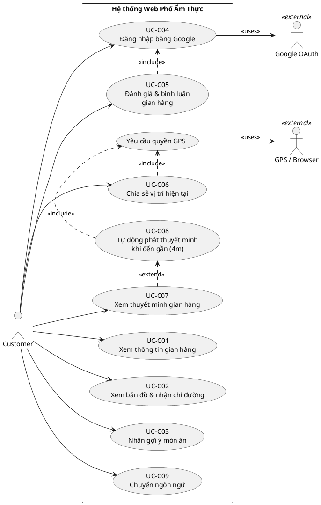

# Use Cases — Customer
> Hệ thống Web Phố Ẩm Thực | Phiên bản: 1.0 | Ngày: 2026-03-28

---

## Use Case Diagram

---

## UC-C01: Xem thông tin gian hàng

| Thuộc tính | Nội dung |
|---|---|
| **ID** | UC-C01 |
| **Tên** | Xem thông tin gian hàng |
| **Actor** | Customer |
| **Mô tả** | Customer xem thông tin chi tiết về gian hàng trên phố ẩm thực (tên, mô tả, danh sách món ăn, hình ảnh). |
| **Precondition** | Gian hàng đang ở trạng thái active. |
| **Postcondition** | Customer xem được thông tin đầy đủ của gian hàng. |

**Luồng chính:**
1. Customer truy cập trang web.
2. Hệ thống hiển thị danh sách các gian hàng đang hoạt động.
3. Customer chọn một gian hàng.
4. Hệ thống hiển thị trang chi tiết gian hàng: tên, mô tả, danh sách món ăn kèm giá của món ăn, hình ảnh.

**Luồng thay thế:**
- [Bước 2] Customer tìm kiếm gian hàng theo tên → hệ thống lọc và hiển thị kết quả phù hợp.

**Luồng ngoại lệ:**
- [Bước 3] Gian hàng bị vô hiệu hóa → hệ thống hiển thị thông báo "Gian hàng hiện không hoạt động".

---

## UC-C02: Xem bản đồ & nhận chỉ đường

| Thuộc tính | Nội dung |
|---|---|
| **ID** | UC-C02 |
| **Tên** | Xem bản đồ & nhận chỉ đường |
| **Actor** | Customer |
| **Mô tả** | Customer xem vị trí các gian hàng trên bản đồ và nhận chỉ đường đến gian hàng mong muốn. |
| **Precondition** | Gian hàng đã được Admin duyệt ghim vị trí trên bản đồ. |
| **Postcondition** | Customer nhận được chỉ đường đến gian hàng. |

**Luồng chính:**
1. Customer chọn chức năng "Xem bản đồ".
2. Hệ thống hiển thị bản đồ phố ẩm thực với các ghim vị trí gian hàng đang hoạt động.
3. Customer chọn một ghim gian hàng trên bản đồ.
4. Hệ thống hiển thị thông tin tóm tắt của gian hàng.
5. Customer chọn "Chỉ đường".
6. Hệ thống tích hợp bản đồ chỉ đường từ vị trí hiện tại của Customer đến gian hàng.
7. Customer theo dõi chỉ đường để đến gian hàng.

**Luồng thay thế:**
- [Bước 6] Customer chưa cấp quyền GPS → hệ thống yêu cầu cấp quyền GPS để xác định vị trí hiện tại → nếu từ chối, Customer nhập điểm xuất phát thủ công.

**Luồng ngoại lệ:**
- [Bước 2] Không có gian hàng nào được ghim → hệ thống hiển thị thông báo "Chưa có gian hàng nào trên bản đồ".

---

## UC-C03: Nhận gợi ý món ăn

| Thuộc tính | Nội dung |
|---|---|
| **ID** | UC-C03 |
| **Tên** | Nhận gợi ý món ăn |
| **Actor** | Customer |
| **Mô tả** | Customer nhập sở thích cá nhân để hệ thống gợi ý món ăn phù hợp tại các gian hàng. |
| **Precondition** | Có ít nhất một gian hàng đang hoạt động trong hệ thống. |
| **Postcondition** | Hệ thống hiển thị danh sách món ăn gợi ý kèm gian hàng tương ứng. |

**Luồng chính:**
1. Customer chọn chức năng "Gợi ý món ăn".
2. Hệ thống hiển thị label để customer chọn (ví dụ: loại món, khẩu vị, dị ứng thực phẩm,...).
3. Customer điền thông tin sở thích và xác nhận.
4. Hệ thống xử lý và trả về danh sách món ăn gợi ý cùng thông tin các gian hàng tương ứng.

**Luồng thay thế:**
- [Bước 3] Customer không điền đầy đủ → hệ thống gợi ý dựa trên các tiêu chi đã điền

**Luồng ngoại lệ:**
- [Bước 4] Không có món ăn nào phù hợp với sở thích → hệ thống hiển thị thông báo "Không tìm thấy gợi ý phù hợp"

---

## UC-C04: Đăng nhập bằng Google

| Thuộc tính | Nội dung |
|---|---|
| **ID** | UC-C04 |
| **Tên** | Đăng nhập bằng Google |
| **Actor** | Customer, Google OAuth |
| **Mô tả** | Customer đăng nhập vào hệ thống bằng tài khoản Google để sử dụng các chức năng yêu cầu xác thực. |
| **Precondition** | Customer có tài khoản Google hợp lệ. |
| **Postcondition** | Customer được xác thực và có thể sử dụng chức năng đánh giá gian hàng. |

**Luồng chính:**
1. Customer chọn "Đăng nhập bằng Google".
2. Hệ thống chuyển hướng đến trang xác thực Google OAuth.
3. Customer chọn tài khoản Google và xác nhận cấp quyền.
4. Google trả về thông tin xác thực cho hệ thống.
5. Hệ thống tạo phiên đăng nhập và hiển thị trạng thái đã đăng nhập.

**Luồng thay thế:**
- [Bước 3] Customer hủy đăng nhập → hệ thống quay về trang trước, Customer ở trạng thái chưa đăng nhập.

**Luồng ngoại lệ:**
- [Bước 4] Google OAuth thất bại (lỗi mạng, token không hợp lệ) → hệ thống hiển thị thông báo lỗi và yêu cầu thử lại.

---

## UC-C05: Đánh giá & bình luận gian hàng

| Thuộc tính | Nội dung |
|---|---|
| **ID** | UC-C05 |
| **Tên** | Đánh giá & bình luận gian hàng |
| **Actor** | Customer |
| **Mô tả** | Customer đã đăng nhập thực hiện đánh giá (rating) và viết bình luận cho một gian hàng. |
| **Precondition** | Customer đã đăng nhập bằng Google (UC-C04). Gian hàng đang ở trạng thái active. Customer chưa đánh giá gian hàng này trước đó. |
| **Postcondition** | Đánh giá của Customer được lưu và hiển thị công khai tại trang gian hàng. |

**Luồng chính:**
1. Customer truy cập trang chi tiết gian hàng.
2. Customer chọn "Viết đánh giá".
3. Hệ thống hiển thị form đánh giá (số sao + nội dung bình luận).
4. Customer chọn số sao và nhập nội dung bình luận.
5. Customer xác nhận gửi.
6. Hệ thống lưu đánh giá và hiển thị ngay trên trang gian hàng.

**Luồng thay thế:**
- [Bước 2] Customer chưa đăng nhập → hệ thống chuyển hướng sang UC-C04, sau đó quay lại bước 2.

**Luồng ngoại lệ:**
- [Bước 2] Customer đã đánh giá gian hàng này → hệ thống hiển thị thông báo "Bạn đã đánh giá gian hàng này rồi" và ẩn nút đánh giá.
- [Bước 5] Nếu người dùng không nhập nội dung bình luận, hệ thống yêu cầu phải chọn ít nhất số sao trước khi gửi đánh giá.

---

## UC-C06: Chia sẻ vị trí hiện tại

| Thuộc tính | Nội dung |
|---|---|
| **ID** | UC-C06 |
| **Tên** | Chia sẻ vị trí hiện tại |
| **Actor** | Customer, GPS / Browser |
| **Mô tả** | Customer chia sẻ vị trí GPS hiện tại của mình qua đường link hoặc tích hợp bản đồ. |
| **Precondition** | Thiết bị của Customer có chức năng GPS và trình duyệt hỗ trợ Geolocation API. |
| **Postcondition** | Vị trí hiện tại của Customer được chia sẻ thành công. |

**Luồng chính:**
1. Customer chọn chức năng "Chia sẻ vị trí".
2. Hệ thống yêu cầu quyền truy cập GPS từ trình duyệt.
3. Customer cấp quyền GPS.
4. Hệ thống lấy tọa độ GPS hiện tại của Customer.
5. Hệ thống tạo đường link chia sẻ vị trí.
6. Customer sao chép link hoặc chia sẻ trực tiếp qua ứng dụng khác.

**Luồng thay thế:**
- [Bước 3] Customer từ chối cấp quyền GPS → hệ thống hiển thị thông báo "Cần bật GPS để sử dụng chức năng này" và không thực hiện chia sẻ.

**Luồng ngoại lệ:**
- [Bước 4] GPS không xác định được vị trí (tín hiệu yếu) → hệ thống hiển thị thông báo lỗi và yêu cầu thử lại.

---

## UC-C07: Xem thuyết minh gian hàng

| Thuộc tính | Nội dung |
|---|---|
| **ID** | UC-C07 |
| **Tên** | Xem thuyết minh gian hàng |
| **Actor** | Customer |
| **Mô tả** | Customer xem nội dung thuyết minh (text) và nghe audio thuyết minh về gian hàng theo ngôn ngữ đang sử dụng. |
| **Precondition** | Gian hàng có bản thuyết minh đã được Admin phê duyệt và đang hoạt động. |
| **Postcondition** | Customer xem/nghe được nội dung thuyết minh của gian hàng. |

**Luồng chính:**
1. Customer truy cập trang chi tiết gian hàng.
2. Hệ thống hiển thị nội dung thuyết minh dạng text theo ngôn ngữ hiện tại của Customer.
3. Customer chọn "Phát audio".
4. Hệ thống phát audio thuyết minh được AI tổng hợp theo ngôn ngữ tương ứng.
5. Customer có thể dừng, tua lại audio bất kỳ lúc nào.

**Luồng thay thế (Extension point — UC-C08):**
- Khi Customer tiến đến gần gian hàng trong phạm vi 4m → UC-C08 được kích hoạt tự động thay thế bước 3–4.

**Luồng ngoại lệ:**
- [Bước 2] Gian hàng chưa có bản thuyết minh được duyệt → hệ thống hiển thị thông báo "Chưa có nội dung thuyết minh".
- [Bước 4] Lỗi tổng hợp audio (AI không khả dụng) → hệ thống chỉ hiển thị nội dung text, thông báo audio tạm thời không khả dụng.

---

## UC-C08: Tự động phát thuyết minh khi đến gần gian hàng

| Thuộc tính | Nội dung |
|---|---|
| **ID** | UC-C08 |
| **Tên** | Tự động phát thuyết minh khi đến gần gian hàng |
| **Actor** | Customer, GPS / Browser |
| **Mô tả** | Khi Customer tiến vào vùng bán kính 4m quanh gian hàng, hệ thống tự động phát audio thuyết minh mà không cần thao tác thủ công. |
| **Precondition** | Customer đã cấp quyền GPS. Gian hàng có bản thuyết minh đã duyệt và ghim vị trí đã duyệt. |
| **Postcondition** | Audio thuyết minh được phát tự động. |

**Luồng chính:**
1. Hệ thống liên tục theo dõi vị trí GPS của Customer (sau khi được cấp quyền).
2. Hệ thống phát hiện Customer tiến vào vùng 4m quanh một gian hàng.
3. Hệ thống tự động phát audio thuyết minh của gian hàng đó.
4. Customer có thể dừng hoặc bỏ qua audio.

**Luồng thay thế:**
- [Bước 2] Customer đứng trong vùng của nhiều gian hàng cùng lúc → hệ thống phát thuyết minh của gian hàng gần nhất.

**Luồng ngoại lệ:**
- [Bước 1] Customer tắt GPS hoặc từ chối quyền vị trí → hệ thống vô hiệu hóa tính năng này và hiển thị thông báo yêu cầu bật GPS.

---

## UC-C09: Chuyển ngôn ngữ

| Thuộc tính | Nội dung |
|---|---|
| **ID** | UC-C09 |
| **Tên** | Chuyển ngôn ngữ |
| **Actor** | Customer |
| **Mô tả** | Customer chủ động thay đổi ngôn ngữ hiển thị của giao diện và nội dung thuyết minh. |
| **Precondition** | Không có. |
| **Postcondition** | Toàn bộ giao diện và nội dung thuyết minh hiển thị theo ngôn ngữ Customer chọn. |

**Luồng chính:**
1. Hệ thống tự động hiển thị ngôn ngữ dựa theo cài đặt trình duyệt của Customer khi truy cập lần đầu.
2. Customer chọn ngôn ngữ mong muốn từ menu chuyển ngôn ngữ.
3. Hệ thống cập nhật giao diện và nội dung thuyết minh theo ngôn ngữ được chọn.

**Luồng ngoại lệ:**
- [Bước 3] AI dịch thất bại cho ngôn ngữ được chọn → hệ thống hiển thị nội dung bằng tiếng Việt (ngôn ngữ gốc) và thông báo "Ngôn ngữ này tạm thời không khả dụng".
