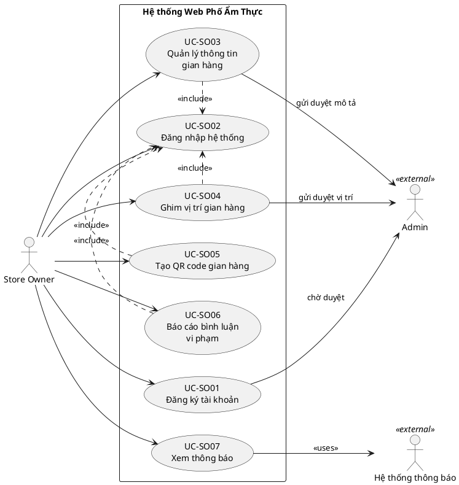

# Use Cases — Store Owner
> Hệ thống Web Phố Ẩm Thực | Phiên bản: 1.0 | Ngày: 2026-03-28

---

## Use Case Diagram

---

## UC-SO01: Đăng ký tài khoản

| Thuộc tính | Nội dung |
|---|---|
| **ID** | UC-SO01 |
| **Tên** | Đăng ký tài khoản |
| **Actor** | Store Owner |
| **Mô tả** | Store Owner tự đăng ký tài khoản trên hệ thống; tài khoản ở trạng thái chờ duyệt cho đến khi Admin phê duyệt. |
| **Precondition** | Store Owner chưa có tài khoản trong hệ thống. |
| **Postcondition** | Tài khoản được tạo ở trạng thái **chờ duyệt**; Admin nhận thông báo có đăng ký mới. |

**Luồng chính:**
1. Store Owner truy cập trang đăng ký.
2. Store Owner điền thông tin: họ tên, email, số điện thoại, tên gian hàng, lý do đăng ký.
3. Store Owner xác nhận gửi đăng ký.
4. Hệ thống tạo tài khoản ở trạng thái **chờ duyệt**.
5. Hệ thống gửi thông báo đến Admin về đăng ký mới.
6. Hệ thống gửi email xác nhận đến Store Owner: "Đăng ký thành công. Vui lòng chờ Admin phê duyệt."

**Luồng thay thế:**
- [Bước 2] Store Owner bỏ trống trường bắt buộc → hệ thống hiển thị lỗi và yêu cầu điền đầy đủ.

**Luồng ngoại lệ:**
- [Bước 3] Email đã tồn tại trong hệ thống → hệ thống thông báo "Email này đã được đăng ký" và yêu cầu dùng email khác.

---

## UC-SO02: Đăng nhập hệ thống

| Thuộc tính | Nội dung |
|---|---|
| **ID** | UC-SO02 |
| **Tên** | Đăng nhập hệ thống |
| **Actor** | Store Owner |
| **Mô tả** | Store Owner đăng nhập vào hệ thống quản lý gian hàng bằng tài khoản đã được Admin phê duyệt. |
| **Precondition** | Tài khoản Store Owner đã được Admin phê duyệt (status = active). |
| **Postcondition** | Store Owner được xác thực và truy cập vào trang quản lý gian hàng. |

**Luồng chính:**
1. Store Owner truy cập trang đăng nhập.
2. Store Owner nhập email và mật khẩu.
3. Hệ thống xác thực thông tin đăng nhập.
4. Hệ thống tạo phiên đăng nhập và chuyển hướng đến trang quản lý gian hàng.

**Luồng ngoại lệ:**
- [Bước 3] Tài khoản đang ở trạng thái **chờ duyệt** → hệ thống thông báo "Tài khoản của bạn đang chờ Admin phê duyệt."
- [Bước 3] Tài khoản bị vô hiệu hóa → hệ thống thông báo "Tài khoản của bạn đã bị vô hiệu hóa. Vui lòng liên hệ Admin."
- [Bước 3] Sai email hoặc mật khẩu → hệ thống thông báo "Email hoặc mật khẩu không đúng."

---

## UC-SO03: Quản lý thông tin gian hàng

| Thuộc tính | Nội dung |
|---|---|
| **ID** | UC-SO03 |
| **Tên** | Quản lý thông tin gian hàng |
| **Actor** | Store Owner |
| **Mô tả** | Store Owner chỉnh sửa thông tin gian hàng gồm tên, mô tả, danh sách món ăn và hình ảnh. Khi lưu, toàn bộ thay đổi chuyển sang trạng thái **chờ duyệt** — thông tin cũ vẫn hiển thị công khai cho đến khi Admin phê duyệt. Trường mô tả sau khi được duyệt đồng thời trở thành nội dung thuyết minh gian hàng. |
| **Precondition** | Store Owner đã đăng nhập (UC-SO02). Gian hàng đã được phân công cho Store Owner. Thông tin gian hàng không đang ở trạng thái **chờ duyệt**. |
| **Postcondition** | Thay đổi được lưu ở trạng thái **chờ duyệt**; thông tin cũ vẫn hiển thị công khai; Admin nhận thông báo. |

**Luồng chính:**
1. Store Owner truy cập trang quản lý gian hàng.
2. Store Owner chọn "Chỉnh sửa thông tin".
3. Hệ thống hiển thị form với thông tin hiện tại: tên gian hàng, mô tả, danh sách món ăn, hình ảnh.
4. Store Owner chỉnh sửa các thông tin cần thay đổi.
5. Store Owner xác nhận lưu.
6. Hệ thống lưu thay đổi ở trạng thái **chờ duyệt**; thông tin cũ vẫn hiển thị công khai.
7. Hệ thống gửi thông báo đến Admin về thay đổi thông tin mới chờ duyệt.
8. Hệ thống hiển thị thông báo cho Store Owner: "Đã lưu. Thông tin đang chờ Admin phê duyệt."

**Luồng thay thế:**

- [Bước 4] Store Owner thêm món ăn mới → nhập tên món, mô tả món, giá; hệ thống thêm vào danh sách.
- [Bước 4] Store Owner xóa món ăn → hệ thống yêu cầu xác nhận trước khi xóa.

**Luồng thay thế — Thông tin đang chờ duyệt (cần thu hồi trước):**

- [Bước 2] Hệ thống phát hiện thông tin gian hàng đang ở trạng thái **chờ duyệt** → hiển thị cảnh báo và chặn chỉnh sửa.
- Store Owner chọn "Thu hồi" → hệ thống yêu cầu xác nhận → Store Owner xác nhận → thông tin chờ duyệt bị hủy, quay về bản hiện hành → Store Owner tiếp tục từ bước 4.

**Luồng thay thế — Thông tin bị từ chối:**

- [Bước 2] Thông tin đang ở trạng thái **bị từ chối** → hệ thống hiển thị lý do từ chối của Admin ngay trên form, cho phép chỉnh sửa ngay.
- Store Owner sửa lại → thực hiện bước 5 → thay đổi tự động gửi duyệt lại (bước 7).

**Luồng ngoại lệ:**

- [Bước 5] Dữ liệu không hợp lệ (tên trống, ảnh quá dung lượng) → hệ thống hiển thị lỗi cụ thể và yêu cầu sửa lại, không lưu.
- [Bước 7] Admin đã duyệt thông tin ngay trong lúc Store Owner đang thao tác thu hồi → hệ thống thông báo "Thông tin đã được Admin duyệt. Không thể thu hồi." và cập nhật lại trạng thái hiển thị.

---

## UC-SO04: Ghim vị trí gian hàng

| Thuộc tính | Nội dung |
|---|---|
| **ID** | UC-SO04 |
| **Tên** | Ghim vị trí gian hàng |
| **Actor** | Store Owner |
| **Mô tả** | Store Owner thiết lập tọa độ vị trí gian hàng trên bản đồ (kéo thả hoặc nhập thủ công) và gửi Admin phê duyệt. |
| **Precondition** | Store Owner đã đăng nhập (UC-SO02). Gian hàng chưa có vị trí ghim đã duyệt hoặc cần cập nhật vị trí. |
| **Postcondition** | Vị trí ghim ở trạng thái **chờ duyệt**; hiển thị công khai sau khi Admin phê duyệt. |

**Luồng chính:**
1. Store Owner truy cập gian hàng của mình và vào mục "Vị trí gian hàng".
2. Hệ thống hiển thị bản đồ tương tác.
3. Store Owner thiết lập vị trí bằng một trong hai cách:
   - **Cách 1:** Kéo thả ghim trực tiếp trên bản đồ.
   - **Cách 2:** Nhập tọa độ (latitude, longitude) thủ công.
4. Hệ thống hiển thị vị trí được chọn trên bản đồ để Store Owner xác nhận.
5. Store Owner xác nhận và chọn "Gửi duyệt".
6. Hệ thống lưu vị trí ở trạng thái **chờ duyệt** và thông báo Admin.

**Luồng ngoại lệ:**
- [Bước 3] Tọa độ nhập thủ công không hợp lệ → hệ thống hiển thị lỗi "Tọa độ không hợp lệ."
- [Bước 3] Tọa độ nằm ngoài khu vực phố ẩm thực → hệ thống hiển thị cảnh báo "Vị trí nằm ngoài phạm vi phố ẩm thực."

---

## UC-SO05: Tạo QR code gian hàng

| Thuộc tính | Nội dung |
|---|---|
| **ID** | UC-SO05 |
| **Tên** | Tạo QR code gian hàng |
| **Actor** | Store Owner |
| **Mô tả** | Store Owner tạo mã QR dẫn đến trang thông tin gian hàng trên web để sử dụng tại quầy. |
| **Precondition** | Store Owner đã đăng nhập (UC-SO02). Gian hàng đang ở trạng thái active. |
| **Postcondition** | QR code được tạo và Store Owner có thể tải xuống để in hoặc hiển thị. |

**Luồng chính:**
1. Store Owner truy cập mục "QR Code" của gian hàng.
2. Store Owner chọn "Tạo QR code".
3. Hệ thống tạo QR code liên kết đến trang chi tiết gian hàng.
4. Hệ thống hiển thị QR code và cung cấp tùy chọn tải xuống (PNG/PDF).
5. Store Owner tải xuống QR code.

**Luồng ngoại lệ:**
- [Bước 2] Gian hàng đang ở trạng thái inactive → hệ thống thông báo "Gian hàng cần được Admin kích hoạt trước khi tạo QR code."

---

## UC-SO06: Báo cáo bình luận vi phạm

| Thuộc tính | Nội dung |
|---|---|
| **ID** | UC-SO06 |
| **Tên** | Báo cáo bình luận vi phạm |
| **Actor** | Store Owner |
| **Mô tả** | Store Owner báo cáo bình luận của Customer tại gian hàng mình nếu cho rằng bình luận vi phạm tiêu chuẩn cộng đồng. |
| **Precondition** | Store Owner đã đăng nhập (UC-SO02). Bình luận đang hiển thị tại gian hàng của Store Owner. |
| **Postcondition** | Báo cáo được lưu; Admin nhận thông báo để xem xét; bình luận vẫn hiển thị bình thường cho đến khi Admin xử lý. |

**Luồng chính:**
1. Store Owner xem danh sách bình luận tại gian hàng của mình.
2. Store Owner chọn "Báo cáo" trên bình luận vi phạm.
3. Hệ thống hiển thị form chọn lý do báo cáo (spam, nội dung không phù hợp, thông tin sai lệch,...).
4. Store Owner chọn lý do và xác nhận gửi báo cáo.
5. Hệ thống lưu báo cáo và gửi thông báo đến Admin.
6. Hệ thống thông báo Store Owner: "Đã gửi báo cáo. Admin sẽ xem xét sớm."

**Luồng ngoại lệ:**
- [Bước 2] Bình luận đã được báo cáo trước đó bởi Store Owner → hệ thống thông báo "Bạn đã báo cáo bình luận này rồi."

---

## UC-SO07: Xem thông báo

| Thuộc tính | Nội dung |
|---|---|
| **ID** | UC-SO07 |
| **Tên** | Xem thông báo |
| **Actor** | Store Owner |
| **Mô tả** | Store Owner xem các thông báo từ hệ thống bao gồm kết quả duyệt thuyết minh, duyệt vị trí và thông báo từ Admin. |
| **Precondition** | Store Owner đã đăng nhập (UC-SO02). |
| **Postcondition** | Thông báo được đánh dấu đã đọc. |

**Luồng chính:**
1. Hệ thống hiển thị số thông báo chưa đọc trên icon thông báo.
2. Store Owner chọn icon thông báo.
3. Hệ thống hiển thị danh sách thông báo theo thứ tự mới nhất.
4. Store Owner chọn một thông báo để xem chi tiết.
5. Hệ thống đánh dấu thông báo là đã đọc.

**Luồng thay thế:**
- [Bước 1] Store Owner nhận thông báo qua email → đọc email và truy cập link trong email để xem chi tiết trên hệ thống.

**Luồng ngoại lệ:**
- [Bước 3] Không có thông báo nào → hệ thống hiển thị "Bạn chưa có thông báo nào."
