# Chương 5 — Triển khai (Viết mới hoàn toàn)

> **Task:** F1
> **Người phụ trách:** Người 1 (chụp screenshots), AI hỗ trợ viết text
> **Vị trí:** Thay thế nội dung Chương 5 (dòng 883-885 Seminar.md)

---

# **CHƯƠNG 5: TRIỂN KHAI** {#chương-5:-triển-khai}

Chương này trình bày môi trường phát triển, giao diện hệ thống và demo các luồng nghiệp vụ chính.

## **5.1 Môi trường phát triển** {#5.1-môi-trường-phát-triển}

### **5.1.1. Công cụ và phần mềm**

| Công cụ | Phiên bản | Mục đích |
| :--- | :--- | :--- |
| Node.js | 18+ | Runtime cho backend (NestJS) và frontend (Next.js) |
| npm | 9+ | Quản lý packages, workspace management |
| Docker Desktop | 4.x | Chạy container PostgreSQL, Redis, MinIO |
| Visual Studio Code | Latest | IDE chính |
| Git | 2.x | Quản lý phiên bản |
| Trình duyệt Chrome/Edge | Latest | Test giao diện và Web Speech API |

### **5.1.2. Hạ tầng Docker**

Hệ thống sử dụng `docker-compose.yml` để khởi tạo 3 dịch vụ:

| Dịch vụ | Image | Port | Mục đích |
| :--- | :--- | :--- | :--- |
| PostgreSQL 15 + PostGIS 3.4 | `postgis/postgis:15-3.4` | 5432 | Cơ sở dữ liệu chính |
| Redis 7 | `redis:7-alpine` | 6379 | Job queue (BullMQ) |
| MinIO | `minio/minio` | 9000 (API), 9001 (Console) | Lưu trữ file (S3-compatible) |

### **5.1.3. Khởi chạy dự án**

```bash
# 1. Khởi động hạ tầng Docker
docker-compose up -d

# 2. Cài đặt dependencies
npm install

# 3. Chạy database migrations
npm run migration:run --workspace=apps/backend

# 4. Seed dữ liệu mẫu
npm run seed --workspace=apps/backend

# 5. Khởi động cả backend + frontend đồng thời
npm run dev
```

Turborepo tự động chạy song song `apps/backend` (port 3001) và `apps/frontend` (port 3000).

## **5.2 Giao diện hệ thống — Customer** {#5.2-giao-diện-customer}

### **5.2.1. Trang danh sách gian hàng**

Trang `/stores` hiển thị danh sách gian hàng active, hỗ trợ:
* Tìm kiếm theo tên (debounce 300ms)
* Chuyển đổi hiển thị Grid / List view
* Filter theo tag sở thích
* Pagination
* Hiển thị badge thuyết minh và tag cho mỗi gian hàng

<!-- Cần bổ sung ảnh trang danh sách gian hàng -->

### **5.2.2. Trang chi tiết gian hàng**

Trang `/stores/:id` hiển thị đầy đủ thông tin:
* Carousel ảnh với thumbnails
* **CommentaryPlayer** (phía trên): nghe thuyết minh text + audio
* Thông tin: tên, mô tả, địa chỉ, SĐT, giờ mở cửa, MXH
* Danh sách menu (tên, giá VND, ảnh, tag)
* Đánh giá và bình luận
* Nút "Xem trên bản đồ"

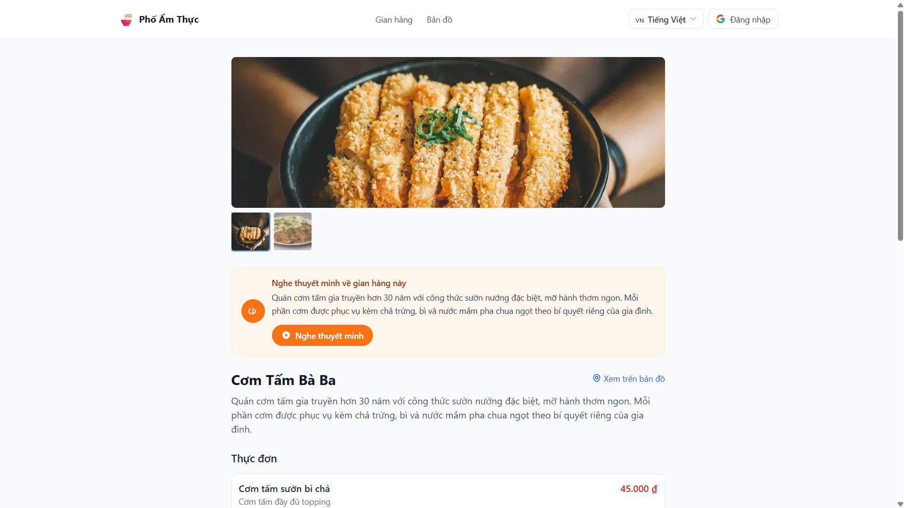
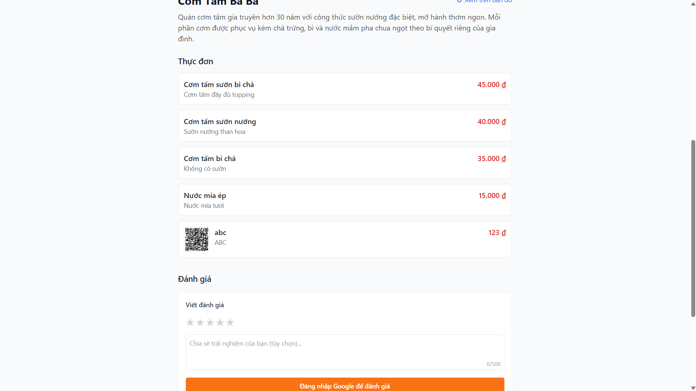

### **5.2.3. Bản đồ tương tác**

Trang `/map` sử dụng Leaflet hiển thị:
* Pin vị trí tất cả gian hàng active
* Vùng ranh giới phố ẩm thực (polygon tô màu)
* Bottom sheet khi nhấn pin (tên, ảnh, giá, nút chỉ đường)
* Tính toán đường đi qua OSRM
* Nút chia sẻ vị trí GPS

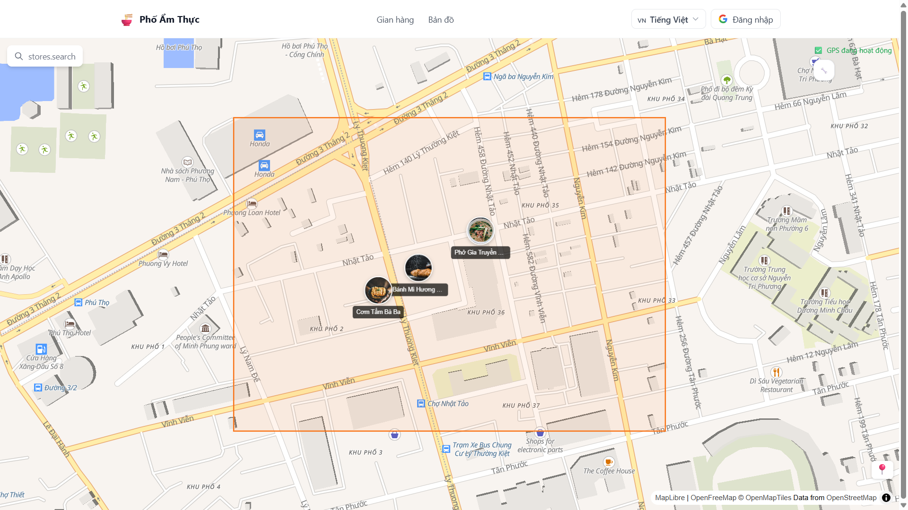
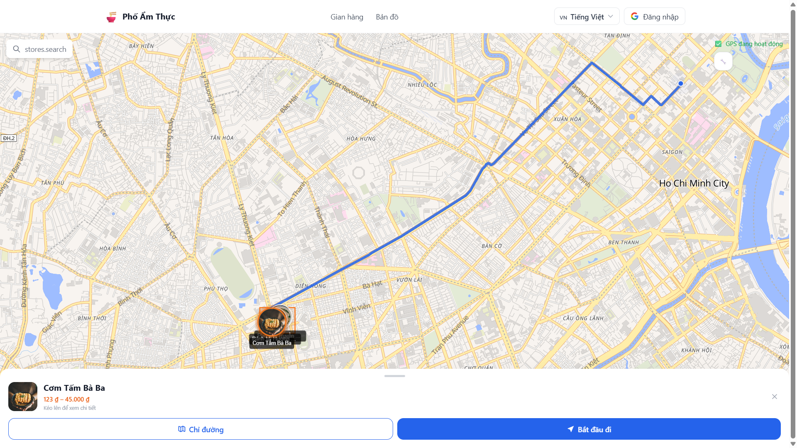

### **5.2.4. QR Scanner**

Trang `/qr/[token]` và QR Scanner modal:
* Mở camera sau (`facingMode: 'environment'`)
* Sử dụng thư viện `jsQR` quét frame-by-frame qua `requestAnimationFrame`
* Giải mã UUID token → redirect đến trang chi tiết gian hàng
* Nếu gian hàng inactive → redirect đến trang `/store-unavailable`

<!-- Cần bổ sung ảnh QR Scanner -->

### **5.2.5. GPS Autoplay**

Khi Customer bật GPS:
* `GpsStatusBar`: hiển thị trạng thái GPS (idle/requesting/granted/denied/unavailable)
* `GpsPermissionBanner`: hướng dẫn bật GPS nếu bị từ chối
* `GpsAutoPlayController`: theo dõi vị trí → phát hiện gian hàng trong 4m → tự động phát thuyết minh
* `AutoplayBanner`: hiển thị nút phát thủ công nếu browser chặn autoplay

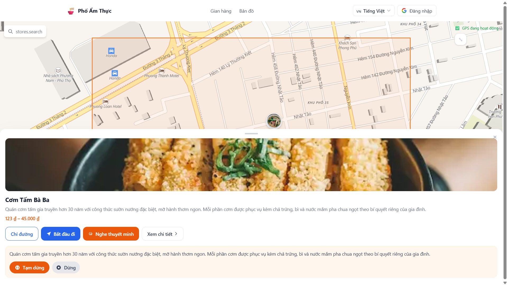

### **5.2.6. Gợi ý món ăn**

Trang `/recommendations`:
* `TagSelector`: chọn 1-5 tag theo nhóm (loại món, hương vị, dị ứng)
* Kết quả hiển thị dạng card: tên món, tên gian hàng, giá, badge match count
* Pagination 20 item/page

<!-- Cần bổ sung ảnh trang gợi ý món ăn -->

### **5.2.7. Chuyển đổi ngôn ngữ**

`LanguageSwitcher` dropdown hỗ trợ 7 ngôn ngữ với cờ quốc gia. Chuyển đổi tức thì, nội dung gian hàng + thuyết minh hiển thị bản dịch tương ứng.

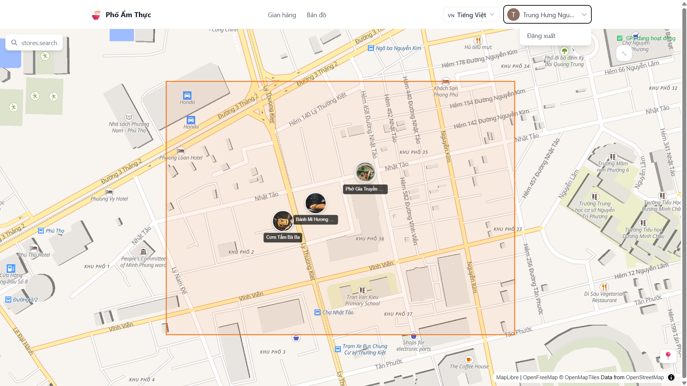

## **5.3 Giao diện hệ thống — Store Owner** {#5.3-giao-diện-store-owner}

### **5.3.1. Dashboard**

Trang `/dashboard` hiển thị tổng quan:
* Thống kê: số đánh giá, điểm trung bình, trạng thái gian hàng
* Thông báo mới nhất
* Quick links đến các chức năng chính

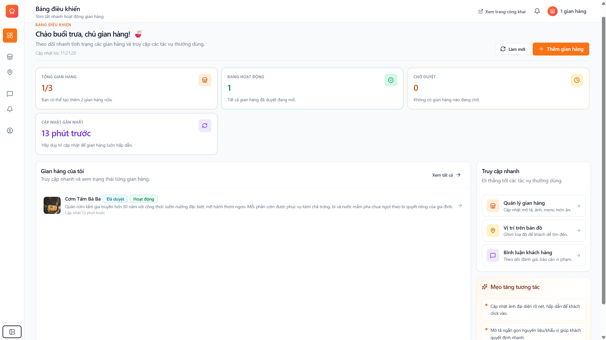

### **5.3.2. Quản lý gian hàng**

Trang `/dashboard/store`:
* Form chỉnh sửa: tên, mô tả, địa chỉ, SĐT, giờ mở cửa, link MXH
* `ImageUploader`: upload ảnh qua presigned URL (JPG/PNG/WebP, max 5MB, max 10 ảnh)
* Nút "Lưu nháp" và "Gửi duyệt"
* Hiển thị trạng thái bản nháp (draft/pending/approved/rejected)

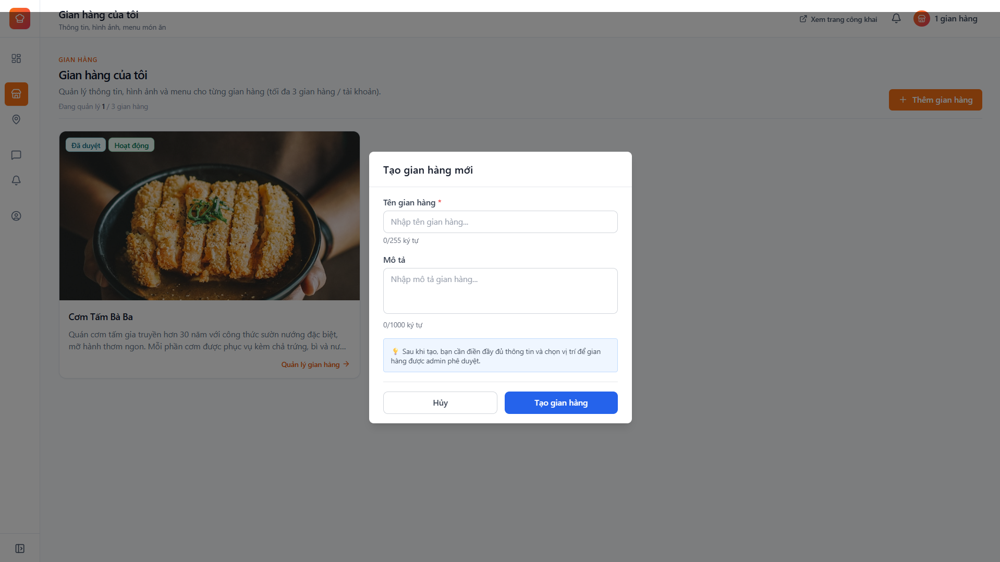

### **5.3.3. Quản lý menu**

Trang `/dashboard/store/menu`:
* Thêm/sửa/xóa món ăn
* Upload ảnh món
* Gắn tag sở thích cho từng món

<!-- Cần bổ sung ảnh trang quản lý menu -->

### **5.3.4. Ghim vị trí**

Trang `/dashboard/location`:
* Bản đồ picker cho phép click chọn vị trí
* Form nhập tọa độ thủ công
* Hiển thị trạng thái ghim (pending/approved/rejected)

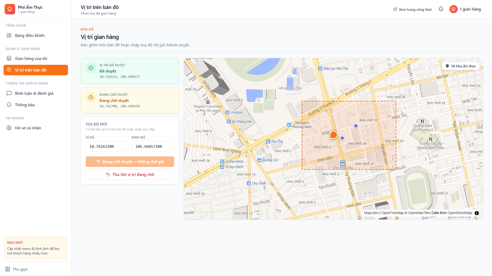

### **5.3.5. Quản lý QR Code**

Trang `/dashboard/qr`:
* Hiển thị QR code hiện tại (192x192px)
* Nút tạo/tái tạo QR code
* Download PNG hoặc PDF

<!-- Cần bổ sung ảnh trang quản lý QR -->

### **5.3.6. Xem đánh giá**

Trang `/dashboard/reviews`:
* Danh sách đánh giá từ khách hàng
* Nút "Báo cáo" cho bình luận vi phạm → mở ReportModal

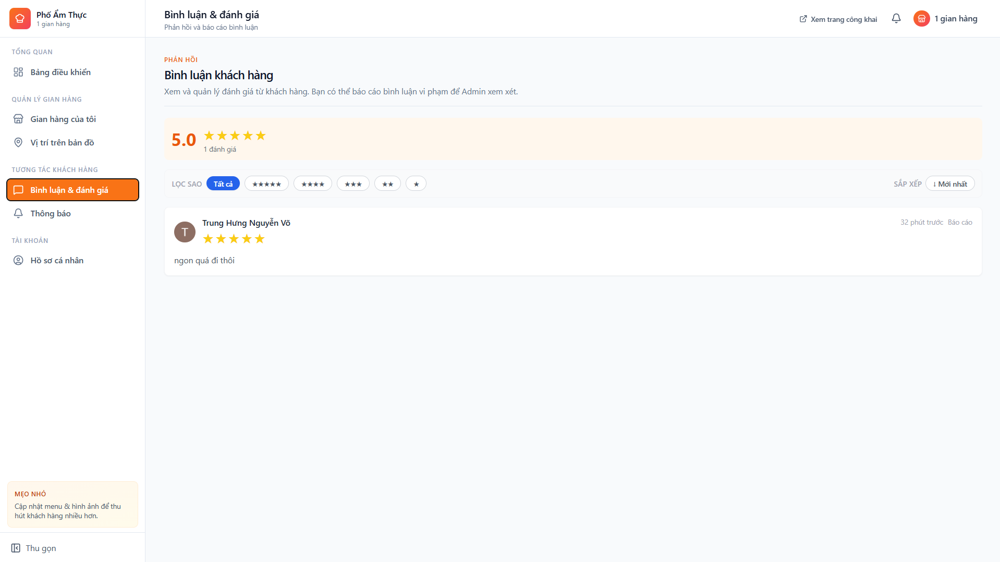

## **5.4 Giao diện hệ thống — Admin** {#5.4-giao-diện-admin}

### **5.4.1. Dashboard tổng quan**

Trang `/admin`:
* `AdminMetricGrid`: thống kê số gian hàng, Store Owner, đánh giá, báo cáo
* Quick links đến các mục quản lý

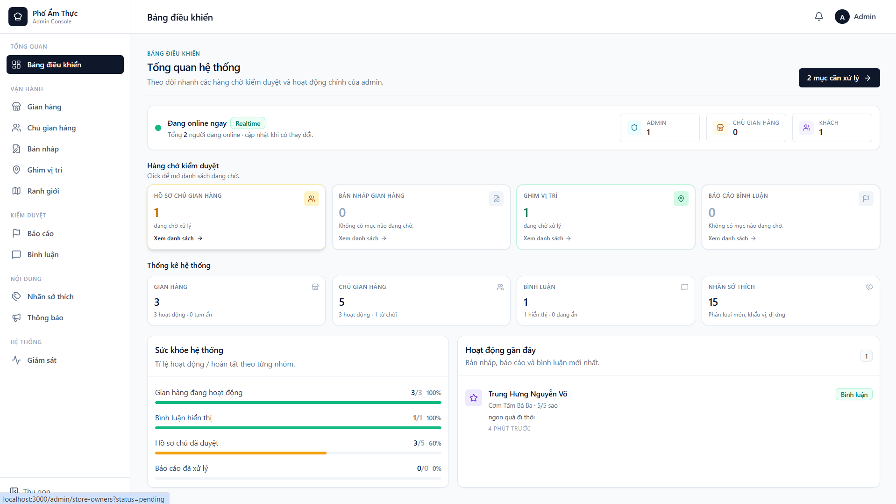
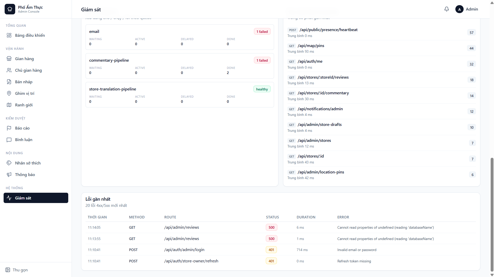
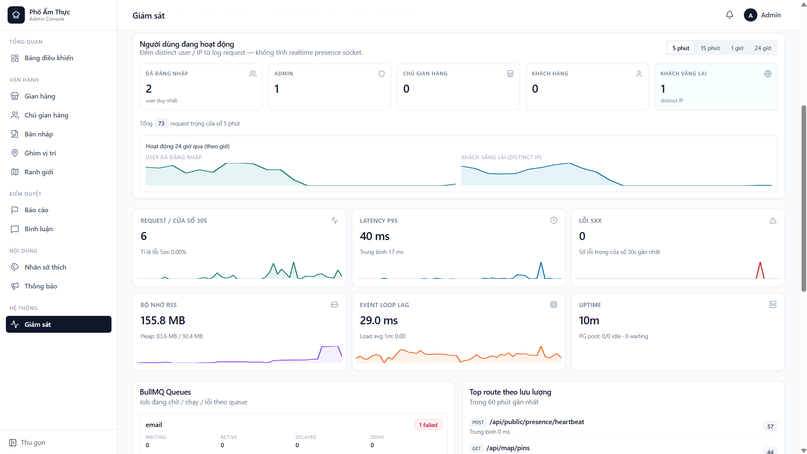

### **5.4.2. Quản lý Store Owner**

Trang `/admin/store-owners`:
* Bảng danh sách với filter (status, search)
* Modal duyệt/từ chối tài khoản (kèm lý do)
* Chi tiết tài khoản: timeline hoạt động

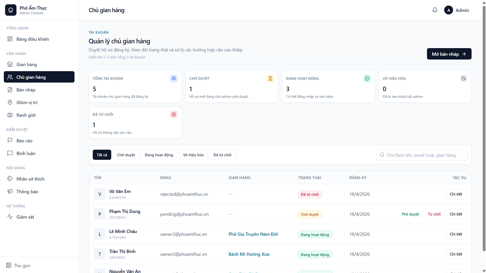

### **5.4.3. Duyệt bản nháp**

Trang `/admin/store-drafts`:
* Danh sách drafts chờ duyệt
* `DraftCompareView`: so sánh nội dung cũ vs mới (side-by-side)
* Modal approve/reject

<!-- Cần bổ sung ảnh so sánh Draft Compare View -->

### **5.4.4. Quản lý vị trí**

Trang `/admin/location-pins`:
* Bảng danh sách ghim
* Chi tiết: bản đồ hiển thị pin + các pin lân cận
* Modal approve/reject/delete

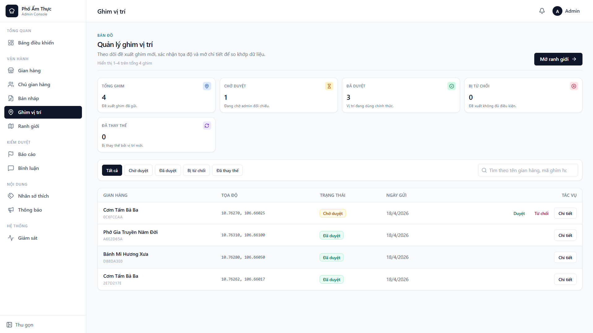
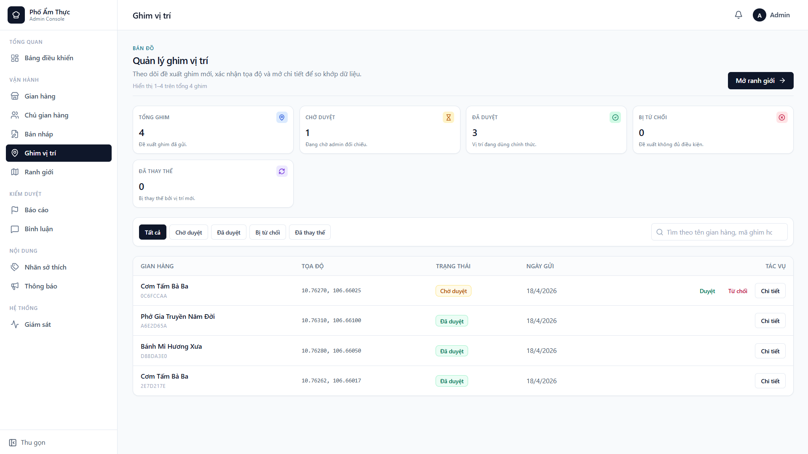

### **5.4.5. Các chức năng khác**

* **Quản lý báo cáo** (`/admin/reports`): resolve (ẩn/xóa review) hoặc dismiss
* **Kiểm duyệt đánh giá** (`/admin/reviews`): ẩn/bỏ ẩn/xóa đánh giá
* **Quản lý ranh giới** (`/admin/boundaries`): chỉnh sửa polygon phố ẩm thực
* **Thông báo** (`/admin/announcements`): tạo + gửi thông báo cho Store Owner
* **Quản lý tag** (`/admin/tags`): CRUD tag sở thích

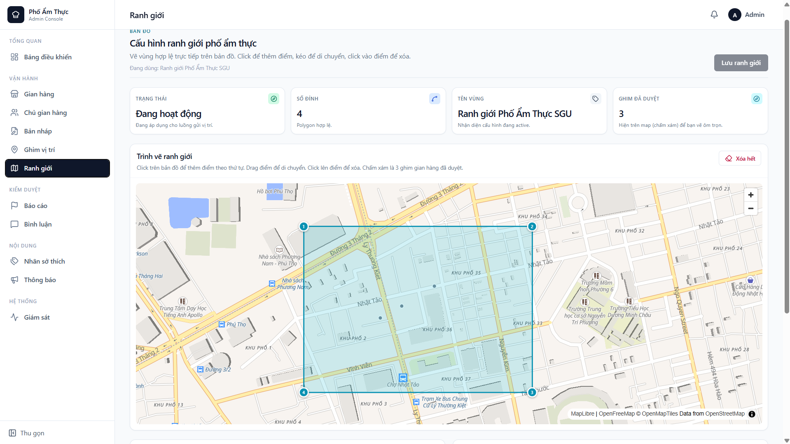
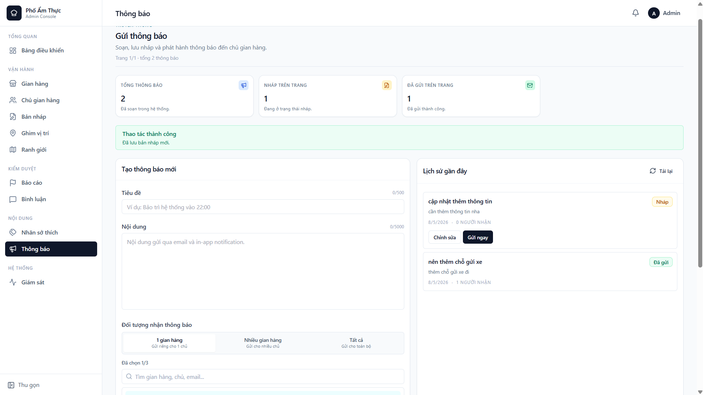
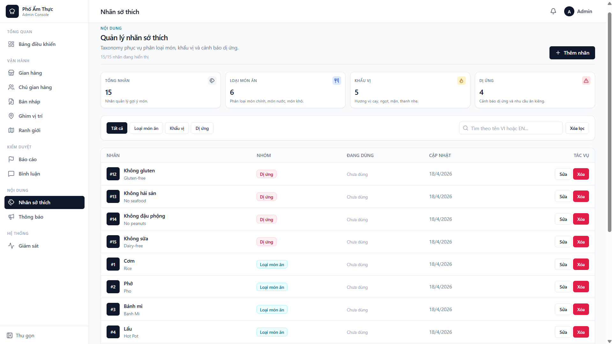
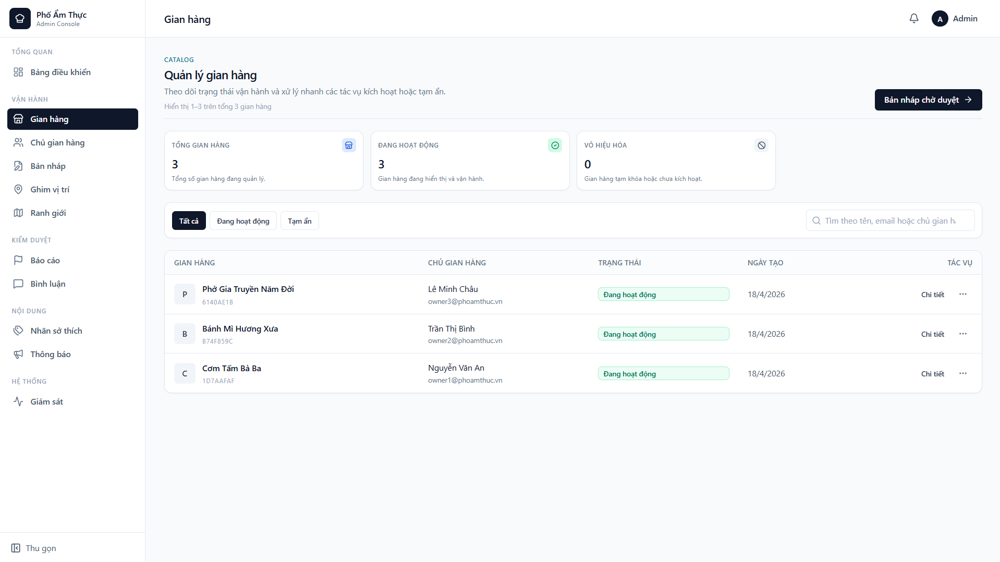

## **5.5 Demo luồng nghiệp vụ chính** {#5.5-demo-luồng}

Luồng đầy đủ từ đăng ký đến trải nghiệm khách hàng:

1. **Store Owner đăng ký** → nhập thông tin + lý do → nhận email xác nhận
2. **Admin duyệt tài khoản** → Store Owner nhận email thông báo
3. **Store Owner tạo gian hàng** → nhập thông tin, upload ảnh, thêm menu, gắn tag
4. **Store Owner lưu nháp + submit** → bản nháp chuyển sang pending_review
5. **Admin duyệt nội dung** → DraftCompareView so sánh → approve
6. **Commentary Pipeline chạy** → dịch thuyết minh sang 6 ngôn ngữ (WebSocket notify)
7. **Store Translation Pipeline chạy** → dịch tên + mô tả + menu
8. **Store Owner ghim vị trí** → Admin duyệt ghim
9. **Store Owner tạo QR Code** → in và dán tại gian hàng
10. **Customer quét QR** → xem chi tiết gian hàng + nghe thuyết minh
11. **Customer bật GPS** → đi ngang gian hàng → thuyết minh tự động phát
12. **Customer đánh giá** → đăng nhập Google → gửi review
13. **Store Owner báo cáo** bình luận vi phạm → Admin xử lý

<!-- Cần bổ sung thêm các screenshot demo toàn bộ luồng nghiệp vụ nếu cần -->
